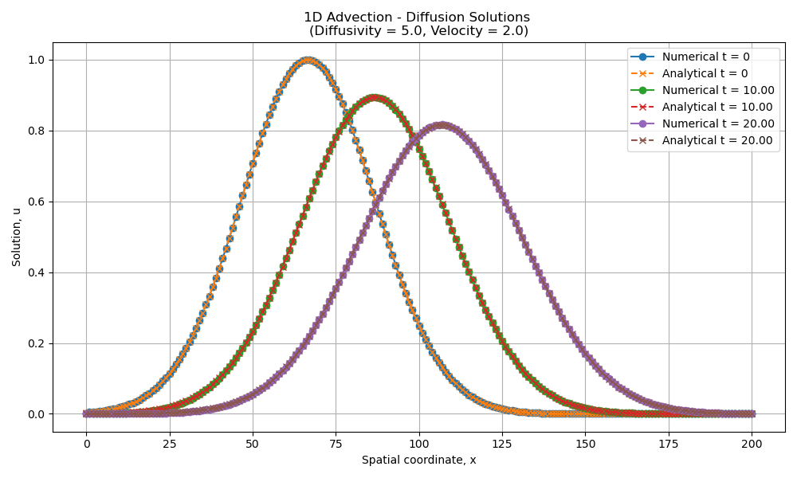
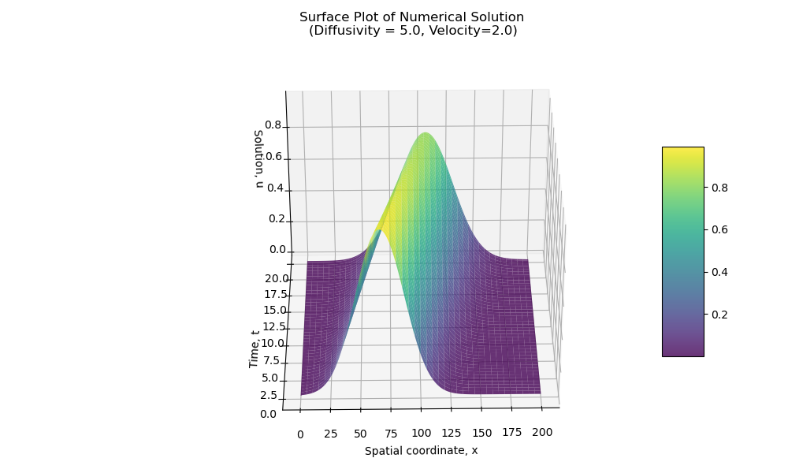

# 1-D Advection-Diffusion Equation 

The 1-D advection-diffusion equation is a parabolic partial differential equation that is given by:

  

where:

- **u(x, t)** is the scalar quantity being transported,
- **v** is the advection velocity,
- **D** is the diffusivity coefficient.

This equation describes the transport of a substance in a medium where both **advection** (transport due to bulk motion) and **diffusion** (spreading due to random motion) phenomoneon are happening simulateneously.
___
## Crank-Nicolson Method 

The **Crank-Nicolson method** is an implicit finite difference scheme that is unconditionally stable, meaning the numerical solution won’t blow up. However, stability alone doesn’t guarantee a physically meaningful solution, especially when advection is involved. The value of accuracy factors (r_diff and r_adv) can serve as guidelines for the user in defining the simulation parameters in configuration.txt.   

The inital distribution of matter is modeled as a Gaussian pulse:

  

Homogeneous Dirichlet boundary conditions are applied which enforce: 

  

Physically, this means that the concentration of matter that is being transported is **fixed at zero** at both ends of the domain for all times.

The spatial domain [0, L] and time domain [0, T] are divided into nx grid points and nx time steps respectively and then corresponding step sizes dx and dt are calculated. The discretization of the 1D advection-diffusion equation using the Crank-Nicolson method is then given as:

  

with the coefficients:

a_c = 1 + r_diff  
a_l = -0.5 r_diff - 0.25 r_adv  
a_u = -0.5 r_diff + 0.25 r_adv  
b_c = 1 - r_diff  
b_l = 0.5 r_diff + 0.25 r_adv  
b_u = 0.5 r_diff - 0.25 r_adv

and the accuracy factors:

r_diff = D * dt / dx²  
r_adv = v * dt / dx

The equation can also be written in matrix form as:

  

where A and B are tridiagnol matrices of size **nx X nx** with Dirichlet boundary conditions applied: 

  

  

___
## Analytical Solution 

The 1D Advection-Diffusion equation can be solved analytically by summing over a series of mirrored Gaussian pulses. The solution is expressed as:

  

Where:

**𝜎** is the standard deviation of the initial Gaussian pulse.
**𝐷** is the diffusivity coefficient.
**𝑣** is the advection velocity.
**𝐿** is the length of the spatial domain.
**𝑡** is the time.
**𝑥₀** is the initial center of the Gaussian pulse.

The term **2m𝐿** accounts for the mirrored reflections across the boundaries.
___

# Project Execution and Structure 

These are the steps to be followed to execute the program and get plotted results:

1. The user defines the simulation parameters in the [configuration.txt](https://github.com/madhurpratap-s/1D-Advection-Diffusion-Solver/blob/main/configuration.txt) file based on its given syntax or can use the pre-defined values. Note that the parameters: length, total_time, nx, nt, diffusivity and velocity are required by the program to run while the parameters: x0, sigma and num_reflections are optional. The local paths to the folders where the solutions are saved must be defined in the configuration file.
2. To start the solver, the user has to run [run_solver.py](https://github.com/madhurpratap-s/1D-Advection-Diffusion-Solver/blob/main/run_solver.py) which imports the simulation parameters from [configuration.txt](https://github.com/madhurpratap-s/1D-Advection-Diffusion-Solver/blob/main/configuration.txt) by default using ConfigParser library. Note that it is possible to use a different file name than **configuration.txt** for the configuration file but the user has to specify the file name when launching the solver from the command line with the syntax ***"python run_solver.py custom_config.txt"***. If the user does not mention the name of the new file, the solver will read the simulation parameters from [configuration.txt](https://github.com/madhurpratap-s/1D-Advection-Diffusion-Solver/blob/main/configuration.txt) only. 
3. The analytical and numerical solutions are saved at the paths defined in the configuration file. The 1-D plot appears first comparing the numerical and analytical solutions over the same grid. The user can manually save the plot if desired. Closing that plot causes the 3D surface plot to appear showing the evolution of the numerical solution through space and time. Snapshots of the 3D solution can be saved from any desired perspective by adjusting the azimuthal and elevation angles to achieve the preferred viewpoint.

This is how I divided the project into blocks:

- In [functions.py](https://github.com/madhurpratap-s/1D-Advection-Diffusion-Solver/blob/main/functions.py), I have built the functions needed for calculating discretization, calculating and checking accuracy factors as per guidelines, setting up inital gaussian pulse, creating matrices for C-N method, applying homogeneous dirichlet boundary conditions and solving the 1-D Advection-Diffusion equation numerically using the Crank-Nicolson method and analytically by summing over a series of mirrored Gaussian pulses.
- In [testing.py](https://github.com/madhurpratap-s/1D-Advection-Diffusion-Solver/blob/main/testing.py), I have tested all the functions in functions.py to ensure that they work as expected.
- In [configuration.txt](https://github.com/madhurpratap-s/1D-Advection-Diffusion-Solver/blob/main/configuration.txt), I have pre-defined the simulation parameters needed for the program to run as well as the local paths where the numerical and analytical solution will be saved.
- In [run_solver.py](https://github.com/madhurpratap-s/1D-Advection-Diffusion-Solver/blob/main/run_solver.py), this is the heart of the project that needs to be executed by the user. Here, the simulation parameters are extracted from the chosen configuration file, accuracy conditions are checked, and both numerical and analytical solutions are computed and saved. In the end, a 1D comparison plot and a 3D surface plot of the numerical solution are generated.
- In [plot.py](https://github.com/madhurpratap-s/1D-Advection-Diffusion-Solver/blob/main/plot.py), there are the two functions that respectively plot the time evolution of the initial gaussian distribution as per the numerical and analytical solution for comparison and make the 3D surface plot of the numerical solution over space and time.

To show the results based on the current [configuration.txt](https://github.com/madhurpratap-s/1D-Advection-Diffusion-Solver/blob/main/configuration.txt):

1. **Plot comparing the time evolution of the initial distribution as per the numerical and analytical solution.**

Note that the advection phenomenon is apparent by the displacement of the inital gaussian distribution while the diffusion phenomenon can be observed in the form of broadening of the peaks over time along with reduction of the peak value.

2. **3D surface plot of the numerical solution over space and time.**

